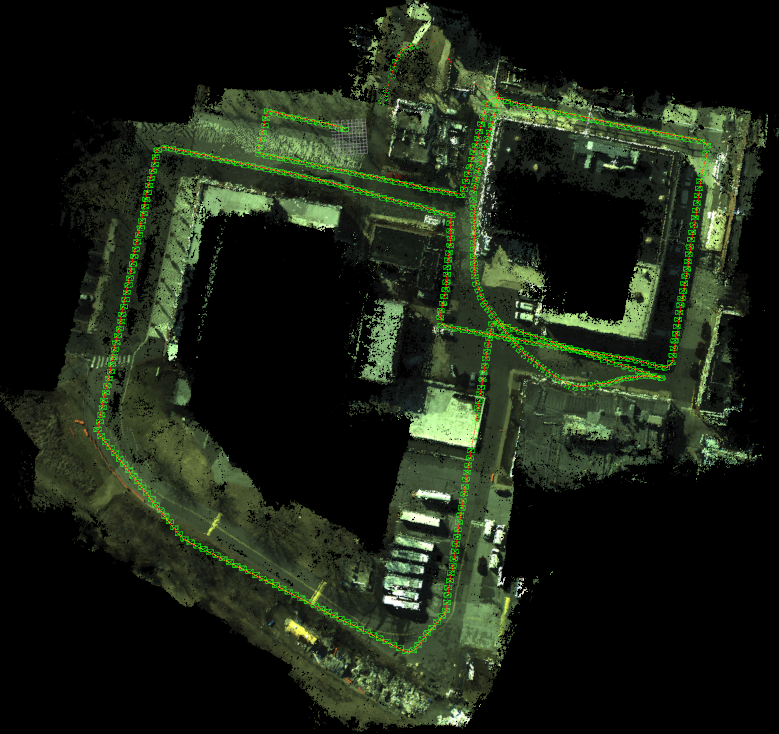

# ASOOM: Aerial Semantic Online Ortho-Mapping



## Paper
This software is a portion of the paper _Stronger Together: Air-Ground Robotic Collaboration Using Semantics_, which can be found on [arXiv](https://arxiv.org/abs/2206.14289) and has been accepted to the IEEE Robotics and Automation Letters.  Please cite this work if you find this code useful.  The paper also has an [accompanying video](https://www.youtube.com/watch?v=4e7eQaG9wB0).

## Citation
```
@ARTICLE{miller2022stronger,  
  author={Miller, Ian D. and Cladera, Fernando and Smith, Trey and Taylor, Camillo Jose and Kumar, Vijay},
  journal={IEEE Robotics and Automation Letters},
  title={Stronger Together: Air-Ground Robotic Collaboration Using Semantics},
  year={2022},
  volume={7},
  number={4},
  pages={9643-9650},
  doi={10.1109/LRA.2022.3191165}
}
```

## Dependencies
* OpenCV (Tested with 3.4)
* Eigen (Tested with 3.3)
* grid_map (Forked version) https://github.com/iandouglas96/grid_map
* GTSAM (Tested with 4.0.3)
* ROS1 (Tested with Melodic and Noetic)

You will also need a compiler with C++17 support (such as GCC 9 or greater).

## Test Data
Some data can be found [here](https://drive.google.com/file/d/1XzIDCkFKaATIreknPa39f1PhiEZI8kid/view?usp=sharing).
To run:
```
roscore
rosparam set /use_sim_time true
roslaunch asoom asoom.launch
rosbag play --clock asoom_demo.bag
```
Then open rviz and load `launch/viz.rviz`.
If you would like to map semantics as well, you will need to also run [ErfNet](https://github.com/iandouglas96/erfnet_pytorch_ros), as well as set the `use_semantics` parameter.
We use ORBSLAM3 for odometry with a wrapper found [here](https://github.com/iandouglas96/orbslam3_ros/).
However, odometry data is included in the provided bag file.
The settings used in our experiments are in `asoom_iros_params.launch`.
